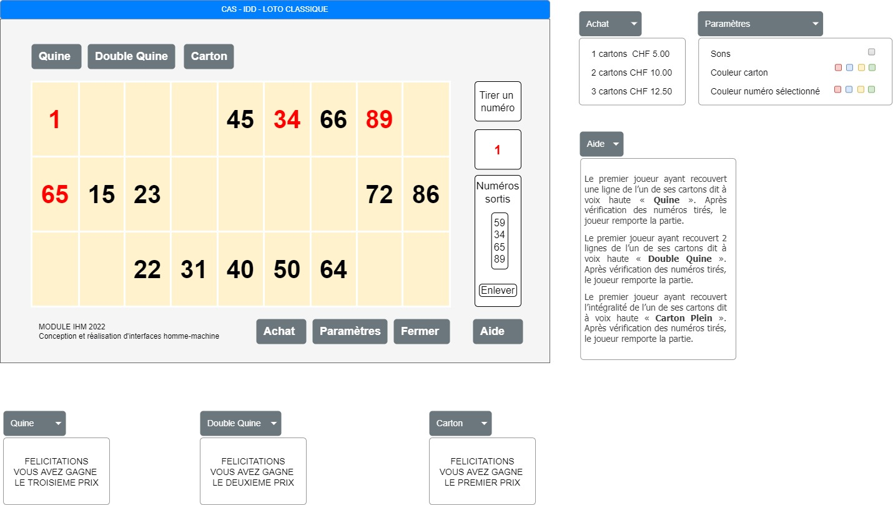

# LOTO

## CAHIERS DES CHARGES
Conception réalisation d’interfaces homme-machine

## Contexte
Dans le cadre du projet IHM, une interface graphique sera réalisée afin de reproduire le jeu du loto classique. En effet, le logiciel permettra de garder les interactions humaines que l’on pourra trouver dans un jeu non-digitalisé. De plus, le programme offrira plusieurs services supplémentaires qui, afficheront les règles ainsi que différents paramètres.

## Objectif

L’objectif est de répondre aux différentes solutions que peut offrir la bibliothèque graphique SWING pour le langage de la programmation Java. Cette librairie donnera une architecture dans laquelle nous pourrons insérer des éléments avec lesquels nous pourrons interagir. Ci-dessous les modules nécessaires pour la création du logiciel.

•	Un carton composé de 15 chiffres répartis sur 3 rangées de 9 cases.
•	Bouton pour tirer un numéro et l’afficher
•	Historique des numéros sortis
•	Boutons pour obtenir les différents prix (Quine, Double Quine, Carton)
•	Boutons généraux (Achat, Paramètres, Fermer, Aide)

## Prototype

<!--  -->

## Problèmes rencontrés

### Méthode randome

la fonction native de java pour générer des numéros aléatoirs peut créer deux même numéro. Pour remédier à se problème, j'ai stocké mes numéros dans un tableau "LinkedHashSet" qui n'accepte pas des doublons.

### Méthode handToken

Lorsque je récupérais un numéro des list de token, la liste historique des numéros ne se mettait pas à jour. La fonction setListData de la classe Jlist permet de récupérer la liste à jour et de l'afficher.

### Différencier le QUIN | DOUBLEQUIN | CARTON

Chaque bouton (quin, doublequin, carton) a une méthode actionPerformed() qui appeler une autre checkSelectedCase(). Ce dernier va ranger chaque bouton selectionné dans un tableau à trois dimensions. Chaque dimension correspond à une rangée de mes bouton sur le logiciel. Pour terminer les actionPerformed() va verifier si toute la rangée a été selectionné.